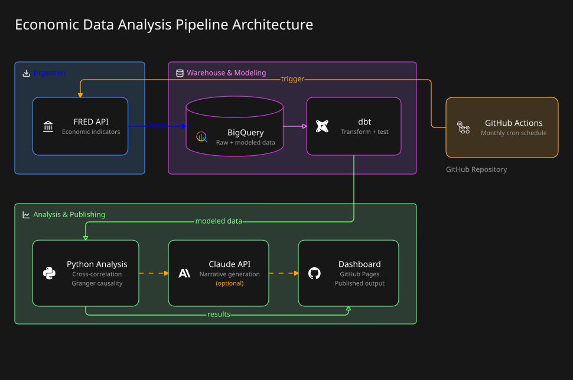

# 📊 Economic Pulse: An End-to-End ELT Pipeline Project

**Does consumer confidence lead the economy?**
This project tests whether how people feel about the economy actually predicts what it does next.

CLICK HERE TO VIEW DASHBOARD ! 

## Objective

In this project, I implemented an end-to-end ELT pipeline that consists of several stages:

1. Extracted Data from the FRED API and loaded them into a BigQuery warehouse.
2. Modeled and tested the data with dbt.
3. Tested the actual hypothesis with cross-correlation and Granger causality.
4. Orchestrated the whole chain on a monthly schedule with GitHub Actions, so it re-runs itself with no manual step.
5. Built a Claude API narrative step that translates the statistical result into a plain-language summary (Currently turned off)
6. Published the result as a live, self-updating dashboard on GitHub Pages.

## Table of Contents

- [Dataset Used](#dataset-used)
- [Stack](#stack)
- [Pipeline Architecture](#pipeline-architecture)
- [What It Found](#what-it-found)
- [Honest Notes](#honest-notes)
- [Design Decisions Worth Asking About](#design-decisions-worth-asking-about)

## Dataset Used

Six series from [FRED (Federal Reserve Economic Data)](https://fred.stlouisfed.org), free with an instant API key:

| Series | Role | Frequency |
|---|---|---|
| `UMCSENT` | Predictor — consumer sentiment | Monthly |
| `UNRATE` | Target — unemployment | Monthly |
| `GDP` | Target — growth | Quarterly |
| `CPIAUCSL` | Context — inflation | Monthly |
| `FEDFUNDS` | Context — policy rate | Monthly |
| `T10Y2Y` | Context — yield curve | Daily |

## Stack

- **Language:** Python, SQL
- **Extraction:** Python
- **Warehouse:** BigQuery
- **Transformation:** dbt
- **Analysis:** statsmodels, scipy
- **Orchestration:** GitHub Actions (monthly cron)
- **Narrative:** Claude API *(optional, disabled)*
- **Dashboard:** Plotly.js on GitHub Pages

## Pipeline Architecture

## What It Found

Consumer confidence does carry real predictive information about unemployment. Kinda.

| | Strongest correlation | Granger-significant lags |
|---|---|---|
| **Unemployment** | 12 months (r = −0.43) | 1, 3, 6 months (3 of 4) |
| **GDP** | 1 month (r = −0.32) | 3, 6, 12 months (3 of 4) |

For unemployment, the 12-month lag has the strongest correlation (r = −0.43), but it is also the only lag that does not reach statistical significance (p = 0.054). Meanwhile, the shorter lags have weaker correlations but are statistically significant.

## Notes

Things a careful reader should know before trusting the numbers:

- **IMPORTANT!** **One CPI data point is a manual override, not an official figure.** BLS never published a standalone October 2025 CPI report during that year's government shutdown, so FRED returns `null` for that date and always will. I decided to override it to 325.0; a figure that I found from a Google search result, and it is not verified against an official BLS release. Every other data point in this project comes straight from FRED with no manual intervention.
- **The AI narrative step is real but unrun.** Python sends the 8 lag-analysis rows plus the latest reading per indicator to Claude for a plain-language summary. It's switched off because the Anthropic API's prepaid minimum isn't worth it for me to pay once a month.
- **Correlation is not causation, and Granger causality isn't either.** This claim is about predictive information, not mechanism.

## My Design Decisions

- **Granger causality over a bare correlation** - Correlation alone can't tell us whether confidence actually comes before and helps predict the economy, or whether the two simply move together. Granger causality gives us a stronger way to test whether past confidence contains useful information for predicting future economic conditions.
- **Why GitHub Actions?** — Idk its easy.  At one run a month, a scheduled workflow like this is the correct tool.

