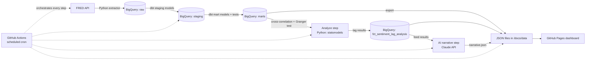

# Economic Pulse: Does Consumer Sentiment Lead the Economy?
### Project Brief & Build Spec

**What this is:** a solo, zero-cost, end-to-end analytics pipeline that tests whether consumer sentiment predicts real economic outcomes, using real Federal Reserve data — modeled in a cloud warehouse, analyzed with a real statistical method, narrated by a scoped AI feature, and published as a live dashboard on GitHub Pages.

**What it demonstrates:** a real research question through to a real answer — SQL/data modeling, statistical analysis (not just charts), ELT pipeline design, dbt, cloud data warehousing, CI/CD-based orchestration, and one deliberate, well-justified AI feature.

---

## Why This Project
*(README-ready — drop this near the top of your repo's frontpage)*

> Consumer sentiment surveys ask people how they *feel* about the economy — but does that feeling actually predict what they go on to do? Consumer spending makes up roughly 70% of U.S. GDP, so if sentiment reliably *leads* unemployment and GDP rather than just reacting to them, it's a genuinely useful early-warning signal — sentiment data comes out faster and cheaper than "hard" economic data. This project tests that question directly using Federal Reserve data and lead-lag statistical analysis (cross-correlation and Granger causality).
>
> It's also, underneath the economics, an attitude–behavior question: does a self-reported attitude actually predict downstream behavior? That's the same validity question I study in experimental psychology — I'm just asking it of macroeconomic data instead of a lab survey.

---

## 1. The Driving Question

**Does consumer sentiment (`UMCSENT`) lead, lag, or merely coincide with actual economic outcomes (`UNRATE`, `GDP`)?**

Answered with two complementary methods:
- **Cross-correlation analysis** — test `UMCSENT` against `UNRATE`/`GDP` at lags of 1, 3, 6, and 12 months to find which lag shows the strongest relationship.
- **Granger causality test** (`statsmodels`) — a stronger claim than correlation: does past sentiment improve prediction of future unemployment *beyond* what past unemployment alone would predict?

This is the part of the project that turns "here are some lines on a chart" into "here's a specific, testable claim, and here's what the data says."

---

## 2. Data Source

**FRED (Federal Reserve Economic Data)** — free API, instant key at `fred.stlouisfed.org`, endpoint `api.stlouisfed.org`, no cost, ~120 requests/minute limit. Python package: `fredapi`.

| Series ID | Role | Frequency |
|---|---|---|
| `UMCSENT` | Predictor (consumer sentiment) | Monthly |
| `UNRATE` | Target outcome (unemployment) | Monthly |
| `GDP` | Target outcome (growth) | Quarterly |
| `CPIAUCSL` | Context (inflation) | Monthly |
| `FEDFUNDS` | Context (policy rate) | Monthly |
| `T10Y2Y` | Context (yield curve) | Daily |

The context series aren't part of the core question but round out the dashboard and give the AI narrative more to work with.

---

## 3. Architecture



Note the **Analyze** step is its own stage, separate from dbt. dbt (SQL) handles cleaning/joining/deriving fields; the actual lag statistics need Python (`statsmodels`/`scipy`), so they live in a dedicated script that reads from the marts and writes results back to a warehouse table. Orchestration (GitHub Actions) is what runs all of these stages, in order, on a schedule, without you triggering them by hand — it sits above the pipeline stages rather than being one of them.

This is also an **ELT** pattern (load raw data first, transform inside the warehouse with dbt) rather than the older ETL-in-Python style — worth naming explicitly in your README.

---

## 4. Tech Stack

| Layer | Tool | Why |
|---|---|---|
| Extraction | Python + `fredapi` | Simple, well-documented |
| Warehouse | **BigQuery Sandbox** | Free (10GB storage / 1TB query per month), no credit card |
| Transformation | **dbt-core** (`dbt-bigquery` adapter) | Industry standard, strong resume signal |
| Analysis | Python + `statsmodels`, `scipy` | Granger causality + cross-correlation — the actual hypothesis test |
| Orchestration | **GitHub Actions** (scheduled workflow) | Free, you already use it, legitimately counts as orchestration at this scale |
| AI layer | **Claude API** | One scoped feature: turns the lag-analysis result into a written narrative |
| Presentation | Static HTML + Plotly.js on **GitHub Pages** | Matches your existing project pattern |

---

## 5. Data Model

**Raw layer** (`raw` dataset): long-format table, loaded as-is from the API.
```
raw_fred_observations(series_id, date, value, loaded_at)
```

**Staging layer** (dbt `stg_` models): typed, deduplicated, renamed.

**Mart layer** (dbt marts):
```
fct_economic_indicators(
  date, series_id, indicator_name, value,
  value_mom_change, value_yoy_change, rolling_12mo_avg
)
```

**Analysis result table** (written by the Python analyze step, not dbt):
```
fct_sentiment_lag_analysis(
  target_indicator,       -- 'UNRATE' or 'GDP'
  lag_months,             -- 1, 3, 6, 12
  cross_correlation,
  granger_p_value,
  strongest_lag_flag,     -- boolean, marks the best-fit lag per target
  computed_at
)
```

Add dbt tests: `not_null`, `accepted_range` on key fields, and a freshness test so a stale pipeline run fails loudly instead of silently.

---

## 6. The AI Feature (scoped deliberately)

After the analyze step runs, a script pulls the current `fct_sentiment_lag_analysis` results (plus the latest values from `fct_economic_indicators`) and sends **only that summarized result set** — not raw data — to Claude, instructing it to write a ~150-word narrative that plainly explains: what lag showed the strongest relationship, whether it's correlation-only or Granger-significant, and what that means in practice, explicitly constrained to the numbers provided so it can't invent claims beyond the analysis. Output is saved as `narrative.json` and shown as a card on the dashboard.

This survives an interview follow-up ("why AI here?") because it's translating a statistical result into plain language — a real analyst task — not a generic summary gimmick.

---

## 7. Orchestration

One GitHub Actions workflow, `.github/workflows/pipeline.yml`:

- **Trigger:** monthly cron (matches `UMCSENT`/`UNRATE` cadence) + manual `workflow_dispatch`
- **Steps:** checkout → set up Python → run extractor → `dbt run` + `dbt test` → run `analyze/lead_lag_analysis.py` → run `ai/generate_narrative.py` → export JSON to `/docs/data/` → commit and push
- **Secrets needed:** `FRED_API_KEY`, a GCP service-account JSON for BigQuery, `ANTHROPIC_API_KEY`

---

## 8. Repo Structure

```
economic-pulse/
├── .github/workflows/pipeline.yml
├── extract/fetch_fred.py
├── dbt/
│   ├── models/staging/
│   ├── models/marts/
│   └── dbt_project.yml
├── analyze/lead_lag_analysis.py
├── ai/generate_narrative.py
├── export/export_for_dashboard.py
├── docs/                  ← GitHub Pages root
│   ├── index.html
│   └── data/{indicators.json, lag_analysis.json, narrative.json}
├── requirements.txt
└── README.md              ← include "Why This Project" section from above
```

---

## 9. Build Phases

1. **Foundation** — get FRED key, write extractor for all six series, confirm raw data lands in BigQuery sandbox.
2. **Modeling** — set up dbt project, staging + mart models, tests.
3. **Analysis** — write `lead_lag_analysis.py`: cross-correlation at each lag, Granger causality test, write results back to BigQuery. This is the heart of the project — get this right before automating anything.
4. **Automation** — build the GitHub Actions workflow end to end (no AI step yet), confirm a scheduled run works unattended.
5. **AI layer** — build and wire in the narrative generator using the lag-analysis results.
6. **Presentation** — build the GitHub Pages dashboard (indicator charts + a dedicated lag-analysis visual, e.g. a correlation-by-lag bar chart) + narrative card, write the README with the "Why This Project" section and architecture diagram.
7. **Stretch (optional)** — extend the same lead-lag method to other predictors (e.g., does the yield curve lead sentiment itself?); World Bank cross-country version; NL-to-SQL query box over the marts.

---

## 10. Starter Prompt for Claude Code

Paste this in to scaffold Phase 1:

> I'm building "Economic Pulse," a project testing whether consumer sentiment (FRED series UMCSENT) leads unemployment (UNRATE) and GDP, using cross-correlation and Granger causality. Pipeline: FRED API → BigQuery (sandbox, free tier) → dbt-core → a Python analysis step (statsmodels) → GitHub Actions for scheduling → a Claude-generated narrative → a static dashboard on GitHub Pages. I'm starting with Phase 1: a Python script using `fredapi` that pulls UMCSENT, UNRATE, GDP, CPIAUCSL, FEDFUNDS, and T10Y2Y and loads them as a long-format table into a BigQuery `raw` dataset using the `google-cloud-bigquery` client. Set up the project structure, `requirements.txt`, and the extractor script, and confirm it runs and lands data before we move to dbt.

---

## 11. Interview Talking Points

- The driving question is an attitude–behavior validity question borrowed from experimental psychology, applied to macro data — ties the project directly to your major instead of reading as a generic tutorial clone.
- Chose Granger causality over a bare correlation because correlation alone can't distinguish "sentiment leads the economy" from "sentiment and the economy just move together" — the stronger, more defensible claim.
- Chose ELT + dbt over the older ETL-in-Python pattern most tutorials still teach.
- Chose BigQuery sandbox specifically to get real cloud-warehouse SQL experience at zero cost.
- Used GitHub Actions instead of Airflow deliberately — named the tradeoff (Airflow needs hosted infrastructure) rather than overselling a tool not actually used.
- AI feature is scoped to one task (narrating a specific statistical result) with an explicit anti-hallucination constraint — can explain *why* it's there, not just that it is.
